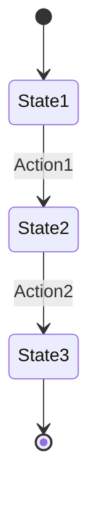

# Feature Design Skill

**Skill**: `/feature-design`
**Purpose**: Phase 2 - Design architecture, events, and service interactions

## Usage

```
/feature-design <feature-name>
```

## Prerequisites

Run `/feature-discovery` first to understand the feature context.

## Instructions

### Step 1: Design Domain Events

For each state change, define a domain event:

```kotlin
// Template: Domain Event
data class [FeatureName]Event(
    override val messageId: UUID,
    override val header: EventHeader,
    override val aggregateId: [Aggregate]Identity,
    // Feature-specific fields
    val field1: Type1,
    val field2: Type2
) : [Aggregate]Event() {
    companion object Factory {
        fun create(aggregateId: [Aggregate]Identity, ...): [FeatureName]Event =
            [FeatureName]Event(
                messageId = UUID.randomUUID(),
                header = EventHeader.create("[aggregate]"),
                aggregateId = aggregateId,
                ...
            )
    }
}
```

List all events needed:
```markdown
## Events Design

| Event Name | Aggregate | Published By | Consumed By | Kafka Topic |
|------------|-----------|--------------|-------------|-------------|
| [Event1]   | Game      | Game         | Player      | game        |
| [Event2]   | Player    | Player       | Game        | player      |
```

### Step 2: Design External Events

For cross-service communication:

```kotlin
// Template: External Event (Kafka)
data class [FeatureName]ExternalEvent(
    override val aggregateId: [Aggregate]Identity,
    override val messageId: UUID,
    // DTO fields for serialization
    val field1: String,
    val field2: Int
) : [Aggregate]ExternalEvent() {
    companion object {
        fun from(event: [FeatureName]Event): [FeatureName]ExternalEvent =
            [FeatureName]ExternalEvent(
                aggregateId = event.aggregateId,
                messageId = event.messageId,
                field1 = event.field1.toString(),
                field2 = event.field2
            )
    }
}
```

### Step 3: Design Commands

For each user action or event handler:

```kotlin
// Template: Command
data class [ActionName]Command(
    override val aggregateID: [Aggregate]Identity,
    val param1: Type1,
    val param2: Type2
) : Command<[Aggregate]>(aggregateID) {

    override fun execute(currentAggregate: [Aggregate]?): Result<[Aggregate]> = runCatching {
        when (val agg = currentAggregate) {
            is [ExpectedState] -> agg.[action](param1, param2)
            else -> throw UnsupportedOperationException(
                "Command not valid for state: ${currentAggregate?.javaClass?.simpleName}"
            )
        }
    }
}
```

List all commands:
```markdown
## Commands Design

| Command Name | Aggregate | Valid States | Produces Events |
|--------------|-----------|--------------|-----------------|
| [Command1]   | Game      | GameExecution| [Event1]        |
| [Command2]   | Player    | PlayerActive | [Event2]        |
```

### Step 4: Design State Machine Changes

If the feature requires state transitions:

```markdown
## State Machine Design

### Current States
[List existing states from codebase]

### New States (if any)
- [NewState]: [Description]

### Transitions
```
[CurrentState] --[Command/Event]--> [NewState]
  Guards: [conditions that must be true]
  Actions: [side effects]
  Events: [events produced]
```

### State Diagram (Mermaid)

```

### Step 5: Design Event Flow (Choreography)

Design the cross-service event flow:

```markdown
## Event Flow Design

### Sequence Diagram
```
┌────────┐     ┌────────┐     ┌────────┐     ┌────────┐
│ Client │     │  Game  │     │ Player │     │ Dealer │
└───┬────┘     └───┬────┘     └───┬────┘     └───┬────┘
    │              │              │              │
    │ 1. REST      │              │              │
    ├─────────────>│              │              │
    │              │              │              │
    │              │ 2. Event     │              │
    │              ├─────────────>│              │
    │              │              │              │
    │              │ 3. Event     │              │
    │              │<─────────────┤              │
    │              │              │              │
    │<─────────────┤              │              │
    │ 4. Response  │              │              │
```

### Event Topics
- Game events: `game` topic (3 partitions, key=gameId)
- Player events: `player` topic (3 partitions, key=gameId)
- Dealer events: `dealer` topic (3 partitions, key=gameId)
```

### Step 6: Design REST API

If user-facing endpoints are needed:

```markdown
## REST API Design

### Endpoint: [METHOD] /[path]

**Request**
```json
{
  "field1": "type",
  "field2": 0
}
```

**Response (200 OK)**
```json
{
  "status": "success",
  "data": {
    "resultField": "value"
  }
}
```

**Error Responses**
| Code | Condition | Body |
|------|-----------|------|
| 400  | Invalid input | `{"error": "description"}` |
| 404  | Game not found | `{"error": "Game not found"}` |
| 409  | Invalid state | `{"error": "Invalid game state"}` |
```

### Step 7: Design Projections

If read models need updates:

```markdown
## Projection Updates

### GameView Changes
- New field: `fieldName: Type` - [description]

### PlayerView Changes
- New field: `fieldName: Type` - [description]

### Projection Handler Updates
- Handle `[NewEvent]` → Update `[field]`
```

### Step 8: Generate Design Document

Output complete design:

```markdown
# Feature Design: [Feature Name]

## 1. Overview
[Brief description of the design]

## 2. Events
[Events table and definitions]

## 3. Commands
[Commands table and definitions]

## 4. State Machine
[State transitions if applicable]

## 5. Event Flow
[Sequence diagram]

## 6. REST API
[Endpoint specifications]

## 7. Projections
[Read model changes]

## 8. Files to Create/Modify

### New Files
- `Common/.../event/game/[Event].kt`
- `Common/.../externalEvents/game/[ExternalEvent].kt`
- `Game/.../commands/[Command].kt`
- `Game/.../handlers/[Handler].kt`

### Modified Files
- `Game/.../models/game/[State].kt` - Add method
- `Game/.../adapters/.../[Router].kt` - Add route
- `Player/.../projection/[View].kt` - Add field

## 9. Design Decisions (ADR)

### Decision: [Title]
- **Context**: [Why this decision was needed]
- **Decision**: [What was decided]
- **Consequences**: [Impact of decision]
```

## Patterns Reference

### Event Naming
- Past tense: `GameCreated`, `CardDealt`, `MeldPlaced`
- Describes what happened, not what to do

### Command Naming
- Imperative: `CreateGame`, `DealCard`, `PlaceMeld`
- Describes the action to perform

### State Naming
- Noun or adjective: `GameDraft`, `GameExecution`, `PlayerActive`
- Describes the current condition
