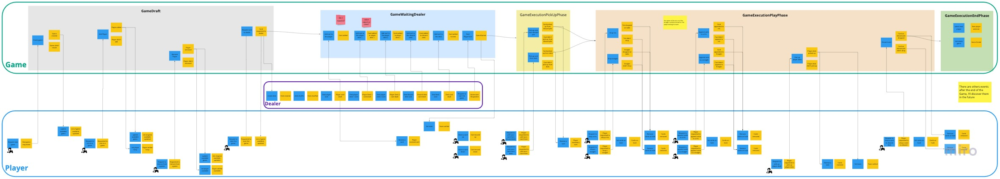
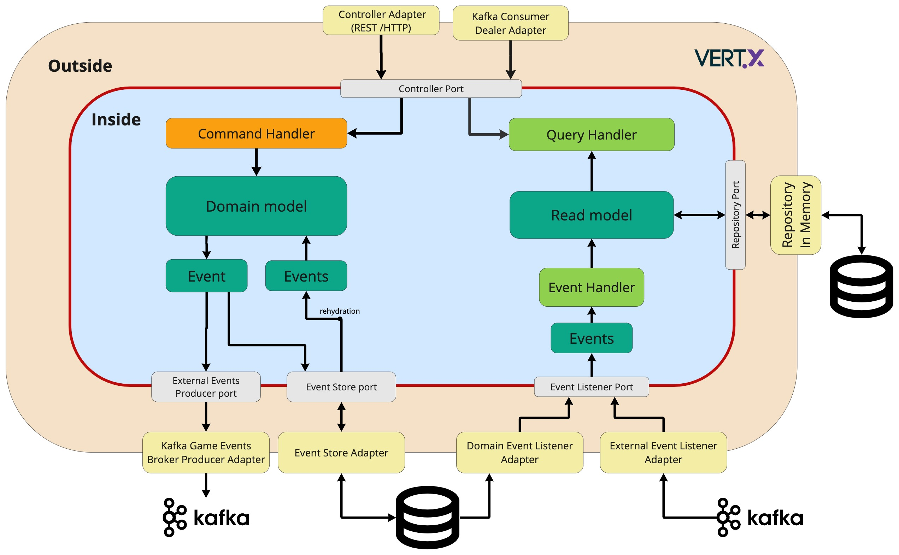

# Burraco Card game

## Design
### Event Storming - Big Picture 
###### (a bit old.. and not complete, definitely needs an update)

### Hexagonal Architecture

### High level service architecture
Each service should follow the architecture below.
Command and Query are separated and managed by 2 different handlers. 
Each command trigger, after its execution, generate a domain event used to update the aggregate state. The same domain event could be converted in an external event in case this information need to be shared even outside the aggregate.
The read model is updated consuming the domain events and the external events based on the read model needs.
The read model is persisted in a database.

## Bounded contexts
### Game
It's the main bounded context of the application, it contains all the logic related to the game execution.
#### GameDraft Commands
- [x] CreateGame
- [x] AddPlayer
- [x] RemovePlayer
- [x] RequestDealCards

#### GameWaitingDealer Commands
- [x] DealPlayerCard
- [x] DealFirstPlayerDeckCard
- [x] DealSecondPlayerDeckCard
- [x] DealDiscardDeckCard
- [x] DealDeckCard
- [x] StartPlayerTurn

#### GameExecutionPickUpPhase Commands
- [x] PickUpACardFromDeck
- [x] PickUpCardsFromDiscardPile

#### GameExecutionPlayPhase Commands
- [x] DropTris
- [x] DropStraight
- [x] AppendCardsOnATris
- [x] AppendCardsOnStraight
- [x] PickUpPlayerDeckDuringTurn
- [x] DropCardOnDiscardPile

#### GameExecutionEndPhase Commands
- [x] StartNextPlayerTurn
- [x] EndGame

### Dealer
It's the bounded context that contains all the logic related to the dealer.
#### Commands
- [x] create Deck
- [x] Deal player card
- [x] Deal player deck 1 card
- [x] Deal player deck 2 card
- [x] Deal discard deck card
- [x] Deal deck card

### Player
It's the bounded context that contains all the logic related to the player.
Player is not a user. A player lives in a game and can be associated to a user. A player without an associated game can't exist.
#### Commands
- [x] create player associated to a game
- [ ] Request to remove from a game
- [ ] Request to start the game
- [ ] Set team
- [ ] Receive a card
- [ ] Move a card up
- [ ] Move a card down
- [ ] Request to pick up a card from discard deck
- [ ] Request to pick up a card from deck
- [ ] Request to drop a tris
- [ ] Request to drop a straight
- [ ] Set cards on hold
- [ ] Remove cards on hold
- [ ] Restore cards on hold
- [ ] Request to append cards to a tris
- [ ] Request to append cards to a straight
- [ ] Request to pick up player deck
- [ ] Request to drop a card to discard deck
