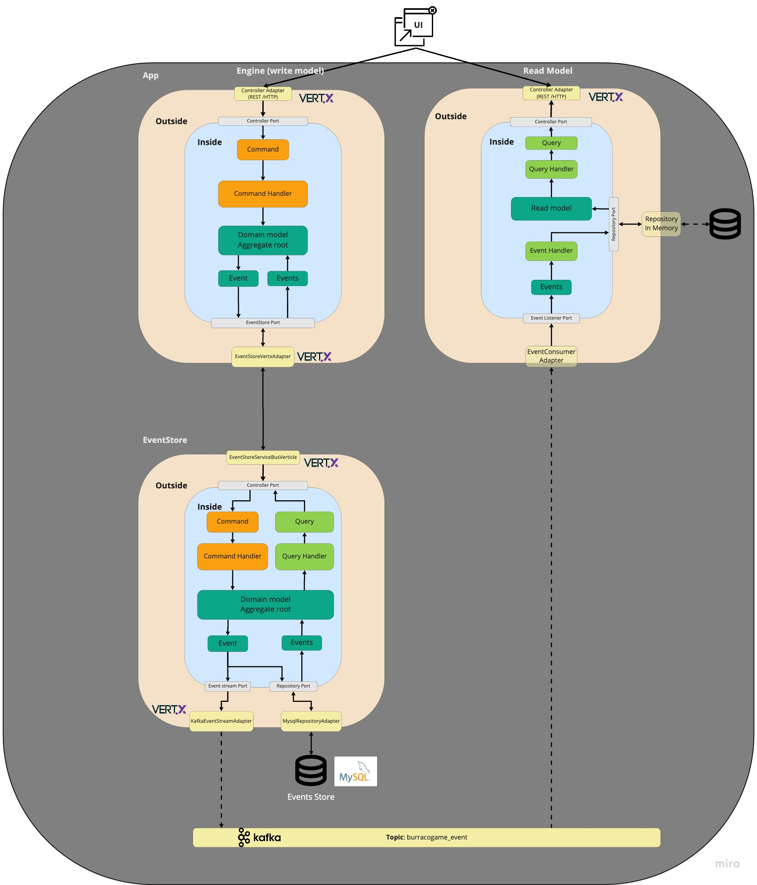

# Burraco Card game Vert.x version...

The scope of this project is trying to introduce Vert.x in an existing DDD project based on Hexagonal architecture without change the domain mode, the commands and the ports.
Vert.x has been introduced creating only new adapters that implement the ports already defined by the project.
More details regarding the original projects are on [https://github.com/abaddon/burraco/](https://github.com/abaddon/burraco/)

*Vert.x components used:*
- cluster
- discovery service
- service proxy
- Web
- Kafka Client
  
## Schema


### Services
##### Engine
It contains the Burraco game logic. An aggregate called BurracoGame contains all the game's rules. 
The REST interface executes the commands on the aggregate.

*Features*
- Vertx HTTP REST API interface

##### EventStore
It's the repository used to store all the domain events generated by the aggregates. Each event received is persisted on a Mysql DB.
The events store receive the event publishing an RPC interface shared throw the Vert.x Eventbus 

*Features*
- Vertx EventBus RPC interface, used to 
- JDBC Mysql client
- Vertx Kafka client

##### ReadModel (TODO)
It will contain all the projections fed from the events generated by the aggregates. 

*Features*


### Execution with Docker
To execute all the services at the same time:

1. to build all the modules at the same time
```
./gradle build
```
1. to create Docker network
```
cd ./scripts
./createNetwork.sh
```
1. to build the Docker images 
```cd .. 
./docker-compose build
```
1. to start-up the Doker environment
```
docker-compose up -d
```
1. to create kafka Topic and check it
```
cd script
./startTestTerminal.sh
[root@5cff4f27237c /]# kafka-topics.sh --zookeeper zk1:2181/kafka --create --topic burracogame_event --partitions 1 --replication-factor 1 --config cleanup.policy=delete --config retention.ms=180000 --config segment.ms=180000
[root@5cff4f27237c /]# kafka-topics.sh --zookeeper zk1:2181/kafka  --list
burracogame_event
```
The environment is now ready. 

### APIs
###### Create a new Burraco game
```
curl --location --request POST 'localhost:8080/games/burraco' \
--header 'Content-Type: application/json' \
--data-raw '{
    "gameType": "BURRACO"
}'
```

###### Add a player in an existing Game
```
curl --location --request POST 'localhost:8080/games/burraco/{burracoGameIdentity}' \
--header 'Content-Type: application/json' \
--data-raw '{
    "playerIdentity": "75673281-5c5b-426e-898f-b8ebbef532ef"
}'
```

### Kafka Consumer
If you want to see the events published in Kafka:
```
cd script
./startTestTerminal.sh
[root@5cff4f27237c /]# kafka-console-consumer.sh --bootstrap-server kafka1:9092 \
--from-beginning \ 
--formatter kafka.tools.DefaultMessageFormatter \
--property print.key=true \
--property print.value=true \
--property key.deserializer=org.apache.kafka.common.serialization.StringDeserializer \
--property value.deserializer=org.apache.kafka.common.serialization.StringDeserializer \
--topic burracogame_event
```