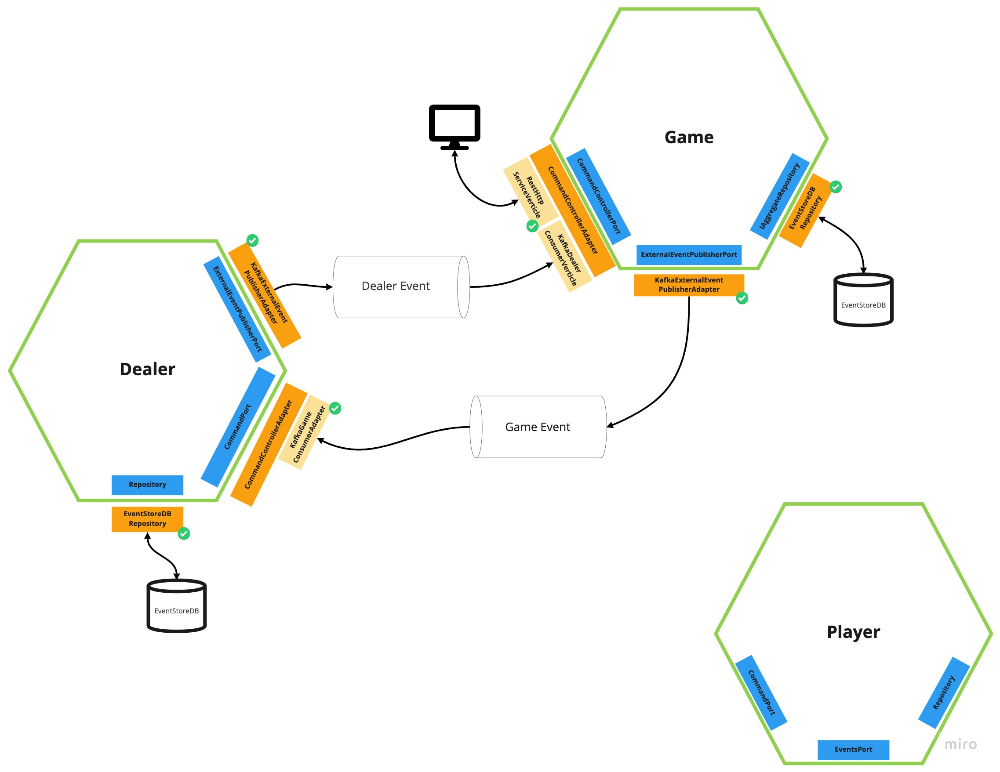

# Burraco Card game

## Design
### Event Storming - Big Picture

### Hexagonal Architecture

## Bounded contexts
### Game
#### GameDraft Commands
- [x] CreateGame
- [x] AddPlayer
- [x] RemovePlayer
- [x] RequestDealCards

#### GameWaitingDealer Commands
- [x] DealPlayerCard
- [x] DealFirstPlayerDeckCard
- [x] DealSecondPlayerDeckCard
- [x] DealDiscardDeckCard
- [x] DealDeckCard
- [x] StartPlayerTurn

#### GameExecutionPickUpPhase Commands
- [x] PickUpACardFromDeck
- [x] PickUpCardsFromDiscardPile

#### GameExecutionPlayPhase Commands
- [x] DropTris
- [x] DropStraight
- [x] AppendCardsOnATris
- [x] AppendCardsOnStraight
- [x] PickUpPlayerDeckDuringTurn
- [x] DropCardOnDiscardPile

#### GameExecutionEndPhase Commands
- [x] StartNextPlayerTurn
- [x] EndGame

### Dealer
#### Commands
- [x] create Deck
- [x] Deal player card
- [x] Deal player deck 1 card
- [x] Deal player deck 2 card
- [x] Deal discard deck card
- [x] Deal deck card

### Player
#### Commands
- [ ] Request new game
- [ ] Update available game
- [ ] Request to join to a game
- [ ] update available game
- [ ] set player busy
- [ ] set player available
- [ ] Request to remove from a game
- [ ] Request to start the game
- [ ] Set team
- [ ] Receive a card
- [ ] Move a card up
- [ ] Move a card down
- [ ] Request to pick up a card from discard deck
- [ ] Request to pick up a card from deck
- [ ] Request to drop a tris
- [ ] Request to drop a straight
- [ ] Set cards on hold
- [ ] Remove cards on hold
- [ ] Restore cards on hold
- [ ] Request to append cards to a tris
- [ ] Request to append cards to a straight
- [ ] Request to pick up player deck
- [ ] Request to drop a card to discard deck